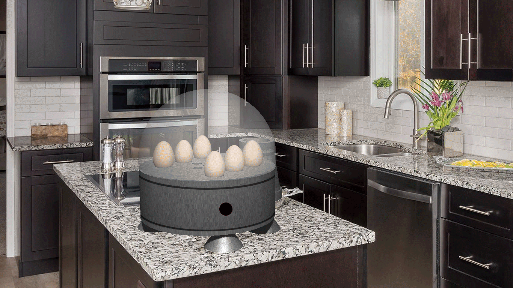
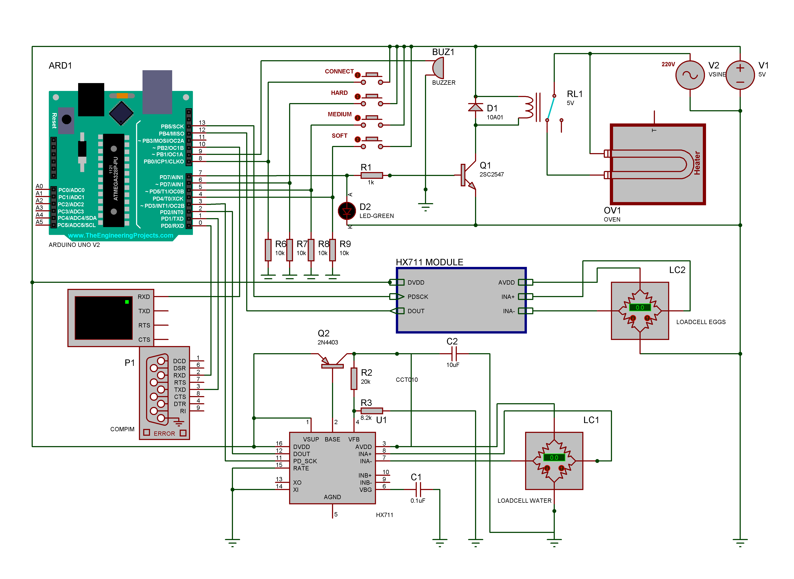
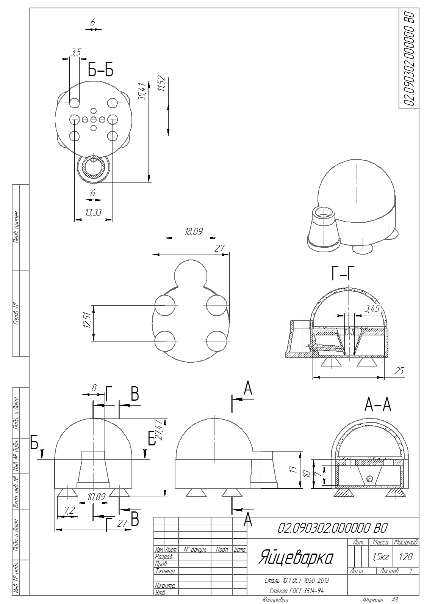
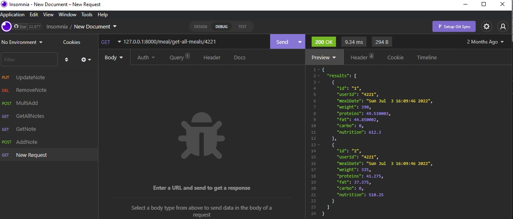
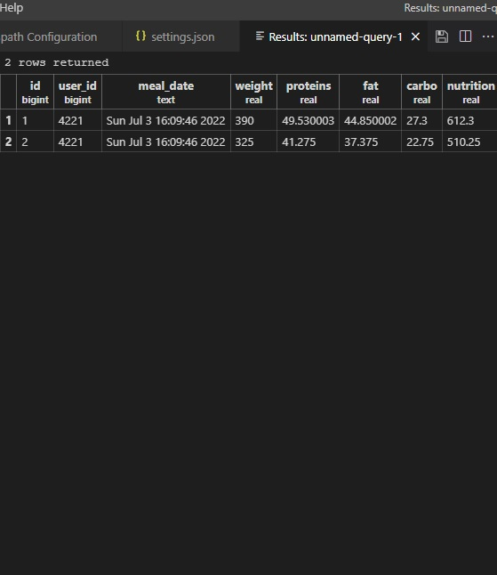

# egg-service-api

	
Это сервис для передачи в базу данных информации, которую передает разработанная мной яцеварка. Визуализация работы устройства:
</justify>   
 
   

	
Для симуляции работы устройства спроектирована схема в Proteus с использованием микроконтроллера Ардуино Uno, датчиков веса HX-711, ТЭНа. Устройство работает в трех режимах (вкрутую всмятку и в мешочек). Программа микроконтроллера написана на C++ и позволяет проверять наличие яиц и воды в отсеках, готовить яйца с помощью трех программ и посылать информацию о приготовленных порциях на сервер через подключенный по COM-порту сетевой адаптер. 
</justify>   
 
   

	
В программе Компас 3D был создан чертеж устройства.
</justify>   
 
   

 

	
Работу серверной части (сервер БД и сервер API полняты в контейнере) можно проверить с помощью Postman/Insomnia
</justify>   
 
   

 

 Информация отразилась  базе данных
</justify>   
 
   

 

 Клиент был написан на Java, он связывается с API сервером с помощью HTTP 1.1 и парсит ответ в объект класса Meal, после чего выводит историю приготовленных блюд.
</justify>   
 
   
